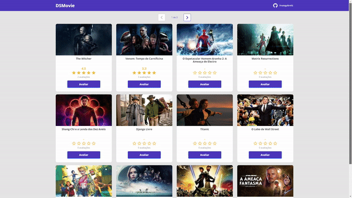

# DSMovie

Este projeto foi realizado durante a semana Spring React
realizada pelo professor [Nelio Alves](https://github.com/acenelio).

## Aprendizados

- Como criar criar um projeto Spring Boot utilizando o Spring Initializr.

- Entender de forma básica a implementação do Backend.

- Colocar tanto a parte do Frontend quanto do Backend na nuvem, utilizando Netlify e Heroku, respectivamente.

- Acesso ao banco de dados.

## Dificuldades

- Conseguir entender como funciona toda a parte do Backend, pois foi um assunto novo e o ritmo do treinamento é acelerado.

## Tecnologias Utilizadas

- React
- TypeScript
- BootStrap
- Spring
- PostgreSQL
- Postman
- Spring Tool Suite
- Axios
## Demonstração

https://dsmovie-maiagabrielc.netlify.app/

